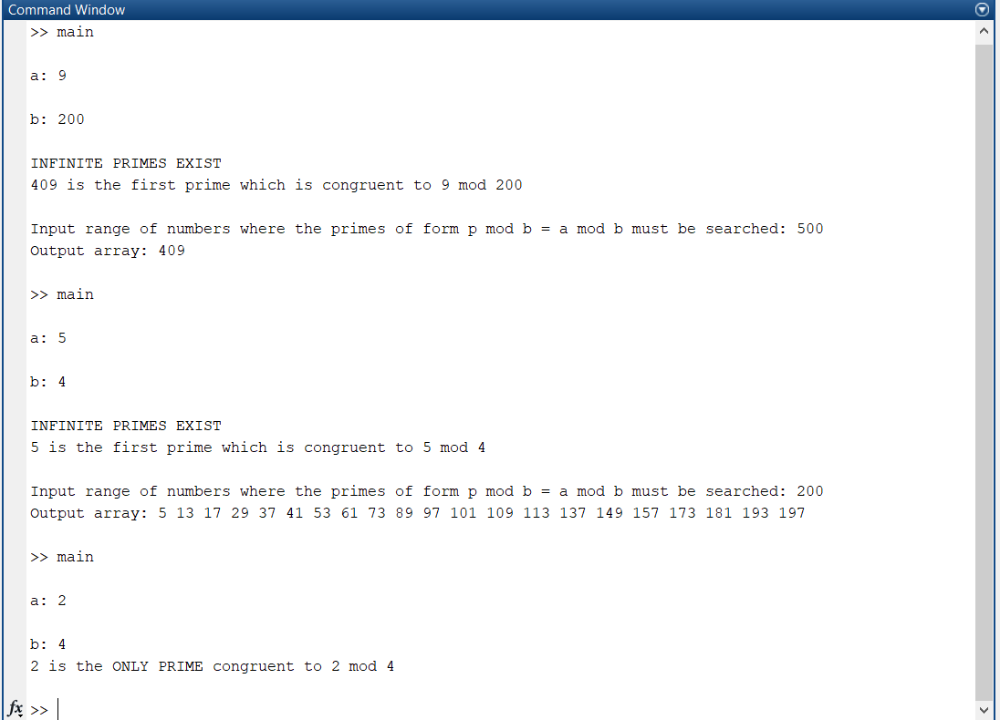

NTC ASSIGNMENT
=
## By

* Sumukha PK 16CO145
* Prajval M 16CO234 

___

## Question
<b>Write a MATLAB code to find a prime p satisfying p ≡ a(modb). Are
there infinitely many such primes, display it.</b>
___

## Solution Proposed

<b>Problem analysis:</b>

* Given a and b, find gcd(a, b)

* gcd(a,b) = 1, <b> Infinite primes congruent to a mod b exist</b>

* Else if gcd(a,b) !=1 <b> Prime p congruent to a mod b may or may not exist. If a mod b such that a > 0, a < |b| and a is a prime then p = a or there are no prime satisfying the conditon.</b>
___

## Approach used : 

### <b>If infinite primes are present and finding the first prime :</b>

* If b = 0, case is not defined as a mod 0 is undefined. Terminate.

* Given a and b, normalize a and b to obtain new a and b such that a, b > 0 and a < b.

* Find gcd of a and b.
    
    * If gcd(a,b) = 1. Infinite primes which are congruent to a mod b are present.[1](https://web.math.pmf.unizg.hr/nastava/studnatj/Dirichlet_theorem.pdf)
    [2](https://sites.math.washington.edu/~morrow/336_14/papers/austin.pdf)
        
        * Find the first prime p, by incrementing i from 0 such that <b>p = a + ib</b>
        and checking if p is a prime
    
    * If gcd(a,b) != 1. Infinite primes which are congruent to a mod b do not exist.[3](README.md##Proofs)

        * If a is a prime, then only 1 prime exists of the form <b>a mod b i.e a</b>.

        * If a is not a prime, then no prime exists of the form a mod b.

### <b>Finding all primes when gcd(a,b) = 1</b>
* Input max
* Given a and b, find all primes p ≡ a mod b by incremnting i in the equation p = a + ib and p in range 0 to max. 
* Output p

<b> Limitations:  </b>
1. We cannot display all the primes when the number of primes are infinite.

We overcome above limitations by asking the user to input a limit of range of prime numbers to be seen.
___

## Proofs

### <b> 1. When gcd is of a, b is not equal to 1 then</b>
    
* If a is a prime then 1 prime exists i.e a of the form p ≡ a mod b or a = 0 and b is prime
* Else no prime exists of the form p ≡ a mod b

<b>Proof:</b>

    Without loss of generality assume a, b > 0 and a < b
    p ≡ a mod b
    p = a + ib where i is any integer

    Let c = gcd(a, b) and c > 1
    
    p = c((a/c )+ i*(b/c))
    p = c(m + i*n) where m and n are positive integers and m < n and non zero
    p = c*k

    As p is prime either c or k must be 1
    c != 1 as c > 1 thus k = 1
    k = 1 implies m + i*n = 1

    As m, n are positive integers m, n > 1

    if m is 0, n = 1

    So b = c. 

    or 
    
    if m is 1, n > 1 but i = 0

    So a = c

    So if a is a prime or if a = 0 and b is a prime are the only ways in which p can be prime.

    Hence Proved

___

## How to run:

* Code can be run only on MATLAB (or octave) compilers.
* Run the main.m file.
* Input the desired numbers 'a' and 'b'.
* If prime of the form p mod b = a mod b exist then the prime is given as output.
* If infinite primes of the form p mod b = a mod b exist, the program prompts for a range until which the primes satisfying the equation will be displayed.
* Finally the list of primes is displayed.

___

## Output
